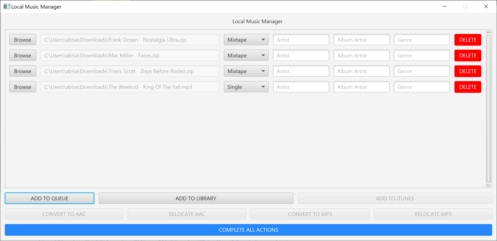
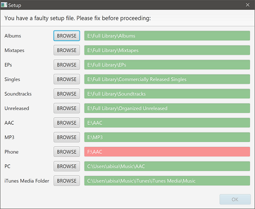

# Local Music Manager
---

### Overview

This is a tool I have built to automate my music library. It allows for archive and audio files to be sorted into a music library, added to iTunes, converted into MP3 and AAC format via iTunes, and have the converted files moved around within the local file system.

Supported archive file types include `.zip`, `.rar`, and `.7z`, while supported audio file types include all that are supported by iTunes, including `.m4a`, `.mp3`, `.aac`, `.wav`, and `.aiff`.

The basic control flow of this program is based on how I organize my own music library:

* To queue up an archive or audio file, press the "ADD TO QUEUE". A new row will appear in the scroll pane. You can select the desired file by pressing the "BROWSE" button.
* You must select a release format for all queued up files before being able to add to your library directory. You can also set Artist, Album Artist, and Genre tags for each queued up file, but it is not necessary.
* All archive files are extracted into a library directory based on the release format as selected through the UI. Audio files can only be marked as a single or an unreleased track. Release formats are as follows:
  * Album
  * Mixtape
  * EP
  * Single
  * Soundtrack
  * Unreleased
* After being extracted, the files can then be added to iTunes.
* Once the files have been added to iTunes, the files can then be converted to MP3 or AAC format using iTunes.
* The program will wait for iTunes to finish all conversions, then give one of the two following options:
  * If the files have been converted to AAC format, it will give the option to copy the files to your phone directory, and then another option to copy the files to your PC directory.
  * If the files have been converted to MP3 format, it will give the option to rename the files for use on a car stereo as follows:
    * `Track Number Song Name.mp3` &rarr; `Artist - Song Name.mp3`
    * For example: `01 King Of The Fall.mp3` &rarr; `The Weeknd - King Of The Fall.mp3`
    * I use .mp3 files to play on my car stereo, so this naming convention is nicer to display than the iTunes standard.
* Before exiting out of the conversion dialog, the user will be presented with the option to delete the converted tracks from iTunes.
* A button for relocating the converted files will then be available, which is necessary to start another conversion process, since iTunes uses the same directory for conversion.
* A sequence of these actions can be triggered with the "Complete All Actions" button. There is a break between adding to iTunes and starting the conversion process to allow the tags to be verified by the user in iTunes. This button also deletes the tracks from the library directory from iTunes and instead adds the converted tracks copied into the PC directory to iTunes.
  * I generally only trigger the actions individually if I want to verify the tags in iTunes before converting.

All directories are read from a setup file of XML type. If the setup file is incomplete, any directories listed in the setup file are invalid, or the setup file is unavailable, a dialog will appear requesting the user to set the directories:

This program is written in Java, using JavaFX for the UI. All scripting for communication between the Java application and iTunes is done using Python.

---

### Requirements

* [JDK 12](https://www.oracle.com/technetwork/java/javase/downloads/jdk12-downloads-5295953.html)
* [JavaFX 12](https://gluonhq.com/products/javafx/)
* [Python 3.7.4](https://www.python.org/downloads/release/)
* [iTunes 12.9.6.3](https://www.apple.com/itunes/download/)
* [Apache Commons Compress](https://commons.apache.org/proper/commons-compress/)
* [Apache Commons IO](https://commons.apache.org/proper/commons-io/)
* [JAudioTagger](http://www.jthink.net/jaudiotagger/)
* [JUnRar](https://github.com/edmund-wagner/junrar)